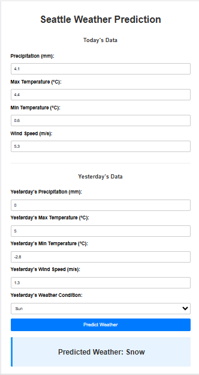

# Seattle Weather Classifier: An End-to-End Machine Learning Project

   

This project demonstrates a complete, end-to-end machine learning workflow for predicting daily weather conditions in Seattle. It begins with exploratory data analysis (EDA), proceeds to sophisticated feature engineering, rigorous model training, and culminates in a deployed Flask web application where users can get real-time predictions based on meteorological data.

The model is trained on the `seattle-weather.csv` dataset, treating the prediction task as a time-series classification problem.

---

### ➡️ Live Demo (Placeholder)
**(If you deploy this, replace the link below with your live URL!)**
`https://flask-ml-weather-prediction.onrender.com/`

### Application Screenshot

---

## Key Features

*   **Methodologically Sound Time-Series Handling:** Employs a chronological train-test split to prevent data leakage and ensure realistic model performance evaluation, a critical step for time-dependent data.
*   **Advanced Feature Engineering:** Creates a rich feature set by incorporating:
    *   **Cyclical Features:** `sin`/`cos` transformations for month and day of the year to capture seasonality.
    *   **Lag Features:** Data from the previous day (e.g., `temp_max_lag1`, `weather_encoded_lag1`) to provide historical context.
    *   **Delta Features:** The rate of change between today's and yesterday's temperatures (`delta_temp_max`).
*   **Rigorous Model Evaluation:** Compares multiple models (Random Forest, Logistic Regression, Naive Bayes) against a naive baseline, with detailed performance metrics including accuracy, classification reports, and confusion matrices.
*   **Model Interpretability:** Analyzes and visualizes feature importances from the best-performing model (Random Forest) to understand which factors most influence the weather predictions.
*   **Interactive Flask Web Application:** The Random Forest model is deployed in a user-friendly Flask application with a robust back-end that handles user input, performs data validation, and serves predictions in real-time.
*   **Scientific Rigor:** Includes an ablation study to systematically measure the impact of different feature subsets on model performance.

## Technology Stack

*   **Backend:** Python, Flask
*   **Data Science:** Pandas, NumPy, Scikit-learn
*   **Visualization:** Matplotlib, Seaborn
*   **Model Persistence:** Joblib

## Project Structure

```
flask_weather_prediction_10_out_of_10/
│
├── artifacts/
│   ├── model_feature_names.joblib
│   ├── weather_label_encoder.joblib
│   └── weather_prediction_model.joblib
│
├── notebook/
│   ├── weather-prediction-ml-10-out-of-10.ipynb
│   └── seattle-weather.csv
│
├── templates/
│   └── index.html
│
├── app.py                  # Main Flask application
├── requirements.txt        # Project dependencies
└── README.md                          
```

## Setup and Installation

Follow these steps to set up the project locally. It is recommended to use a virtual environment.

1.  **Clone the repository:**
    ```bash
    git clone https://github.com/SteveAustin583/flask_weather_prediction_10_out_of_10.git
    cd flask_weather_prediction_10_out_of_10
    ```

2.  **Create and activate a virtual environment:**
    *   **For Unix/macOS:**
        ```bash
        python3 -m venv venv
        source venv/bin/activate
        ```
    *   **For Windows:**
        ```bash
        python -m venv venv
        venv\Scripts\activate
        ```

3.  **Install the required dependencies:**
    ```bash
    pip install -r requirements.txt
    ```

## Usage

### 1. Running the Flask Application

To start the web server and use the prediction interface:

1.  Ensure you are in the root directory of the project.
2.  Run the following command:
    ```bash
    flask run
    ```
3.  Open your web browser and navigate to `http://127.0.0.1:5000`.

### 2. Exploring the Model Training Process

The Jupyter Notebook in the `notebook/` directory contains all the steps for data exploration, preprocessing, feature engineering, and model training.

1.  Start a Jupyter Notebook server from your project's root directory:
    ```bash
    jupyter notebook
    ```
2.  Navigate to `notebook/` and open `weather-prediction-ml-10-out-of-10.ipynb`.